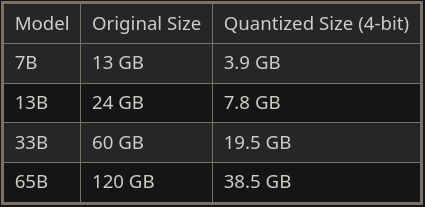

# Structured Sentiment Analysis using In-Context Learning

Martin Popovski

---

## Who am I?

* Education
  - FINKI
  - Generation 2018
  - Major Computer Science
  - Took NLP course
* Professional experience
  - 2 years at Netcetera
  - Machine Learning Engineer
  - Mainly working with Large Language Models

---

## The task

- Extract opinion tuples from a sentence
  - opinion holder
  - opinion target
  - opinion expression
  - opinion polarity


---

## Example use case


---

## The data


---

## Example sample

```json
{
    "sent_id": "ula/116CUL032-6",
    "text": "As a provider of youth services , MCCOY , Inc. is here to support your valuable efforts to develop young people .",
    "opinions": [
        {
            "Source": [
                ["MCCOY , Inc."],
                ["34:46"]
            ],
            "Target": [
                ["efforts"],
                ["80:87"]
            ],
            "Polar_expression": [
                ["support"],
                ["58:65"]
            ],
            "Polarity": "Neutral",
            "Intensity": "Average"
        }
    ]
}
```

---

## Traditional Approaches vs In-Context Learning

---

## Traditional Approaches

* Fine tune a pre-trained model on the specific task
  - e.g. BERT, RoBERTa, XLM-RoBERTa etc.
* Requires a lot of data
* Computationally expensive to train (fine tune)
* Computationally efficient to use

---

## In-Context Learning

* Large language models are fine tuned on general instruction following tasks
  - e.g. GPT-3.5 Turbo, Llama 2 Chat, WizardLM, Vicuna, Orca, Platypus etc.
* Requires a lot less data
* Task specific fine tuning is not required
  - Although possible
* Computationally inneficient to use
  - Depending on the model size

---

## What LLM should I use?

* Cloud based
  - OpenAI
    - GPT-3.5
    - GPT-4
* Locally hosted
  - Llama 2
  - Mistral
  - Falcon
  - Yi
  - Tigerbot
  - Many more

---

## Hardware requirements for local LLMs

---

## Quantization

- Floating point precision
  - 16 bit - default precision for most LLMs
  - 8 bit quantization - ~2x memory reduction
  - 4 bit quantization - ~4x memory reduction
- Quantization formats
  - GGML and GGUF
    - CPU+GPU inference
  - GPTQ and AWQ
    - GPU inference



---

## Hardware examples

- 8 GB VRAM
  - GTX 1070, GTX 1080, RTX 2060 Super, RTX 2070, RTX 2080, RTX 3070
  - 7B at 4 bit quantization
- 12 GB VRAM
  - RTX 3060, RTX 3080
  - 13B at 4 bit quantization
- 24 GB VRAM
  - RTX 3090, RTX 4090
  - 13B at 8 bit quantization
  - ~30B at 4 bit quantization
- 48 GB VRAM
  - 2 * RTX 3090 / RTX 4090
  - ~30B at 8 bit quantization
  - ~70B at 4 bit quantization

---

## Choosing the right LLM

- <https://huggingface.co/spaces/HuggingFaceH4/open_llm_leaderboard>


---

## What to look out for

* Production release or test release
* What is it fine tuned for?
  - General instruction following
  - Conversing
  - Code generation
  - Role playing
* What languages does it support?
* Context size
* Licence

---

## Note the prompt template


---

## Find a quantized version of the model

- <https://huggingface.co/TheBloke>


---

## How to host the model locally?

- oobabooga's Text generation web UI
- ollama
- Text Generation Inference
- transformers

---

## Meanwhile GPT users be like


---

## What I used

- RTX 3070 8 GB VRAM
- Orca Mini V3
  - Based on Llama 2 7B
  - GPTQ 4 bit 128 group size with act order
- oobabooga's Text generation web UI
  - ExLlama backend

---

## Example sample again

```json
{
    "sent_id": "ula/116CUL032-6",
    "text": "As a provider of youth services , MCCOY , Inc. is here to support your valuable efforts to develop young people .",
    "opinions": [
        {
            "Source": [
                ["MCCOY , Inc."],
                ["34:46"]
            ],
            "Target": [
                ["efforts"],
                ["80:87"]
            ],
            "Polar_expression": [
                ["support"],
                ["58:65"]
            ],
            "Polarity": "Neutral",
            "Intensity": "Average"
        }
    ]
}
```

---

## First attempt

* Ideas
  * Provide the LLM with few shot examples from the training data
  * Define the expected output JSON schema to the LLM
  * Give the LLM the test data sentence as input
  * Parse the output of the LLM as a JSON
* Problems
  * The smaller 7B model is not capable of handling the complexity of the JSON
    - It doesn't comform to the JSON schema
  * The model doesn't always give an exact substring from the sentence
    - It corrects misspellings and spacings even when told not to
  * LLMs have no concept of character counts and offsets
    - They work with tokens

---

## Second attempt

* Ideas
  * The substring position can be calculated afterwards deterministically
  * Use fuzzy search using Levinshtein distance to find the closest match substring in the sentence
    - Most probable match under a dynamic distance threshold
  * Simplify the JSON schema

---

## Simplified Option Example

```json
{
    "Source": "MCCOY , Inc.",
    "Target": "efforts",
    "Polar_expression": "support",
    "Polarity": "Neutral",
    "Intensity": "Average"
}
```

---

## Simplified Option Schema

```json
{
  "$defs": {
    "Intensity": {
      "enum": ["Average", "Strong", "Standard", "Weak", "Slight"],
      "title": "Intensity",
      "type": "string"
    },
    "Polarity": {
      "enum": ["Neutral", "Positive", "Negative"],
      "title": "Polarity",
      "type": "string"
    }
  },
  "properties": {
    "Source": {
      "anyOf": [{"type": "string"}, {"type": "null"}],
      "title": "Source"
    },
    "Target": {
      "anyOf": [{"type": "string"}, {"type": "null"}],
      "title": "Target"
    },
    "Polar_expression": {
      "title": "Polar Expression",
      "type": "string"
    },
    "Polarity": {
      "$ref": "#/$defs/Polarity"
    },
    "Intensity": {
      "anyOf": [{"$ref": "#/$defs/Intensity"}, {"type": "null"}]
    }
  },
  "required": ["Source", "Target", "Polar_expression", "Polarity", "Intensity"],
  "title": "SimpleOpinion",
  "type": "object"
}
```

---

## Prompt Template

```text
### System:
You are an AI assistant that follows instruction extremely well. Help as much as you can.

### User:
The task is to predict all structured sentiment graphs in a text (see the examples below).
We can formalize this as finding all the opinion tuples O = Oi,...,On in a text.
Each opinion Oi is a tuple (h, t, e, p) where h is a holder who expresses a polarity p towards a target t through a sentiment expression e,
implicitly defining the relationships between the elements of a sentiment graph.
The response should be a resperesentation of the opinions and must always be in the form of a json list of objects.
Each object must follow the following json schema:
{schema}
The response fields Source and Target may be null or a string.
The fields Source, Target and Polar_expression must be exact substrings from the input text,
they must not be altered in any way, no spelling corrections, no formatting corrections,
no skipping or adding words, the field must be an exact character for character substring in the input text.
The field Polarity must be one of the following: "Neutral", "Positive", "Negative".
Intensity must be one of the following: null, "Average", "Strong", "Standard", "Weak", "Slight".
If there are no opinions in the text, the response should be an empty list.

{examples}
### User:
{input}

### Assistant:

```

---

## Choice of few shot examples

* The examples should be as diverse as possible and cover as many edge cases as possible
* 20 examples fit in the context size of 4096 tokens
  - Shuffle train dataset
  - 1 example with 0 opinions
  - 9 examples with 1+ opinion
  - 10 examples with 2+ opinions
* Possible improvements for example selection?
  * Store the sentences in a vector database and select the most similar examples to the input sentence

---

## How to handle LLM invalid responses?

* Use a retry strategy
  - Retry 5 times with the same prompt, if all 5 responses are invalid, predict no opinions

---

## Extra reading resources

- <https://www.reddit.com/r/LocalLLaMA/wiki/index/>
  - New models, discussions, hardware, hosting, etc.
- <https://python.langchain.com/docs/>
  - LangChain LLM framework
- <https://docs.llamaindex.ai/>
  - LlamaIndex LLM framework specialized for RAGs
- <https://www.deeplearning.ai/short-courses/>
  - Good free courses for LLMs and LangChain
- <https://github.com/martinkozle/NLP-semeval22_structured_sentiment/tree/master/llm_solution>
  - My code for this project
- <https://github.com/martinkozle/NLP-guest-presentation>
  - This presentation

---

### Discussion
